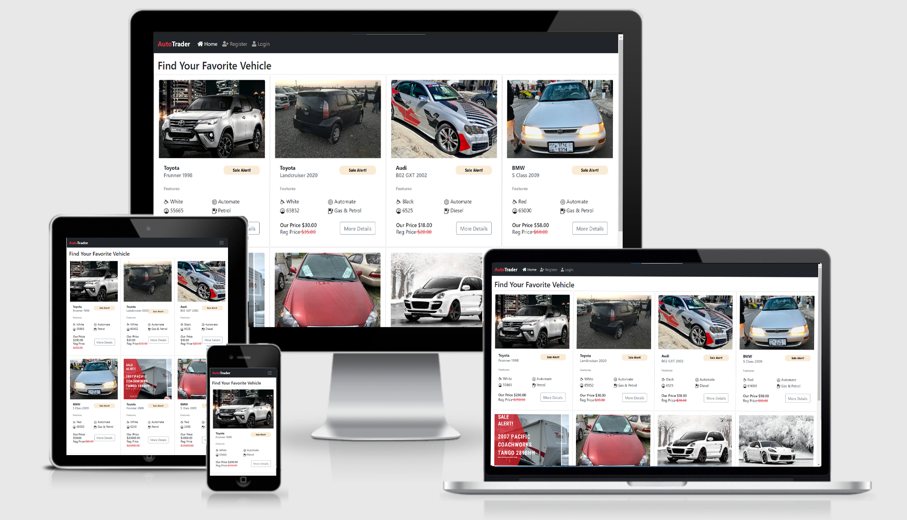

AutoTrader

AutoTrader is a popular app for buying and selling vehicles, providing a comprehensive solution for car buyers and sellers, with a wide range of features and services.

<a href="https://autotrader.herokuapp.com/" target="_blank">Visit the live project here</a>

 

## Requirements

1. if you want to login as admin please enter the following username and password to login
    * Username: allah
    * Password: allah
2. if you want to login as normal user you can click on register button in login page.

## Features

1. Users can create user account.
2. Users can see the vehicle details and mail for seller.
3. Users can comment and review on vehicles.
4. Admins can approve or reject vehicle to be published.
5. Admins can approve or reject reviews.
6. This a full responsive webapp

## Files & Directories
1. autotrader - project directory.
2. utils.py - Contains all Django helper functions used in views.py.
3. urls.py - This file handles all the URLs of the project.
4. shop - main application directory.
5. static - contains all static content.
6. css - Contains all css files for styling the webpages.
7. js - Contains all javascript files used in the application.
8. img - Contains all image files used in the application.
9. templates Contains all application templates.
10. index.html - Template for showing all vehicles.
11. vehicle_details.html - Template for showing details for each vehicle.
12. login.html - Login user page.
13. register.html - Register user page.
14. admin.py - Contains some models for access to the Django administrator.
15. models.py - All models used in the application are created here.
16. views.py - This file contains all the application views.
17. requirements.txt - This file contains all contains all the python packages that needs to be installed to run this web application.
18. manage.py - This file is used basically as a command-line utility and for deploying, debugging, or running our web application.

## Installation
1. Install project dependencies by running py -m pip install -r requirements.txt.
2. Run the commands py manage.py makemigrations and py manage.py migrate in the project directory to make and apply migrations.
3. Create superuser with py manage.py createsuperuser.
4. Run the command py manage.py runserver to run the web server.
5. Open web browser and goto 127.0.0.1:8000 url to start using the web application.